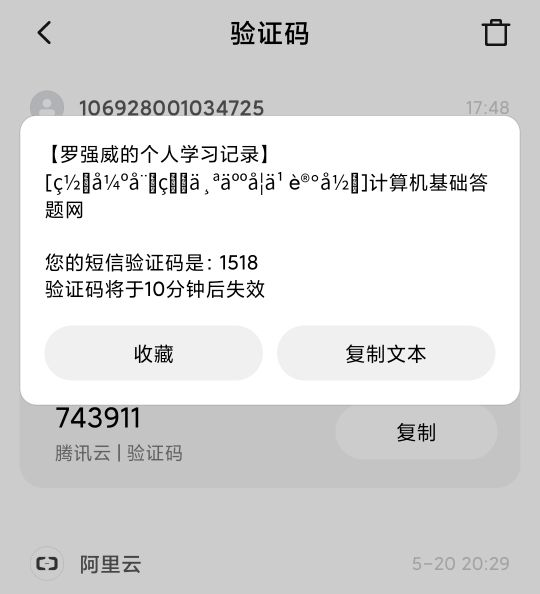

# AI应用平台

[TOC]

## 简介

​		在基于阿里云智能视觉平台的视觉API服务下，我们小组搭建了一个智能AI平台，在这个AI平台中，我们上线了五个不同的的AI视觉应用功能，分别是  身份证识别，智能相册，车辆保险，视频高清化，表格识别，视频去水印，我们还为这个平台设计了一个注册登录系统，以保障平台的安全运行。下面我们将介绍每个不同功能。


## 部署方式

1. 填写好src/main/resources的application.properties或application.yml

示例如下：

```properties
server.port=80

# Upload Dir 就保存在jar所在的目录
file.uplaod.path=base/static/images/idcard/
file.uplaod.carpath=base/static/images/car/
imagePath=base/static/img/

vedio.upload.path=base/static/video/
file.upload.imgPath=.
storagePath=base/static/data/

aliapi.accessKeyId=[your aliyun api accessKeyId]
aliapi.accessKeySecret=[your aliyun api accessKeySecret]

# Upload config  [上传文件大小限制]
spring.servlet.multipart.max-file-size=5000MB
spring.servlet.multipart.max-request-size=5000MB

# Mysql
spring.datasource.driver-class-name=com.mysql.cj.jdbc.Driver
spring.datasource.url=jdbc:mysql://[your host]/[your database]?useUnicode=true&characterEncoding=utf-8&useSSL=true
spring.datasource.username=[your mysql passord]
spring.datasource.password=[your mysql passord]

# Tomcat 就保存在jar所在的base目录(自动创建)
server.tomcat.basedir=base

# 腾讯短信
appkey=[your tencent appkey]
appid=[your tencent appid]
templateId=[your tencent templateId]
smsSign=[your tencent smsSign]
secretId=[your tencent secretId]
secretKey=[your tencent secretKey]

# Redis
redis.maxIdle = 2000
redis.minIdle = 10
redis.maxTotal = 35000
redis.host = [your redis host]
redis.port = [your redis port. defalut port is 6379]
redis.password = [your redis password]

# Token : 这是token失效时间， 单位 秒
token-timeout=600

# 设定分布式ID的机器号
machine_id=0
```

2. java -jar [产生在Taget文件夹中的jar包]


## 开发和部署环境

- OpenJdk 14
- Maven 3.6.3
- IntelliJ IDEA 2020.1
- MySQL 8.0
- Redis 5.0.7


## 数据库

### MySQL 使用


其中password使用SHA 512位加密。

ID使用自制的分布式ID生成器（**Nanoflake**）生成，使用机器号0，方便以后多数据库时的表单合并，防止ID冲突。

其他敏感信息将使用RSA 2048位（或8192位）或者AES算法加密，但是为了方便，只写好了加密用的工具类，并没有真正应用。

### Redis使用

Redis主要用来作为Token和短信验证的验证码存放区域，设置时间为10分钟后失效。

不过在这个项目中，Token工具类经过我的不断改进，它已经比平常使用Redis的效率要高**几倍**。

这个Token工具类具有读Reids、写Redis、和内存回收三类线程，并且可以自行扩充（未来实现），它将会自动使用Pipeline进行对Redis高速插入和读取，所有的处理时机，都由Token中的线程进行处理，调用者无需理解其中的逻辑，即可简单地进行使用。


## 系统结构


### Controller介绍

- AlbumController负责响应”智能相册“功能的请求，比如上传图片啦，需要什么种类的图片啦~
- IDCardController负责响应”身份证识别“功能的请求
- MainController负责响应“主页”、“登录”和“注册”功能的请求，登录错误次数过多，可是要**惩罚**输入验证码的！登录、注册和验证的表单中都插入了**Token**，防止部分爬虫登录、注册和验证。
- MotorInsureController负责响应“车辆保险”的请求，它还绘制了**无比真实的保险单**！印章的位置和方向是随机的~它还会最终处理保单的费用和保价，营运车辆当然不可能和其他车辆一样的保费，稍微要贵yi点  ˋ( ° ▽、° ) 
- VideoController负责响应“视频高清化”和“视频去水印”功能的请求


### Dao介绍

UserDao接口负责与Mysql直接，执行用户数据的操作

### Filter介绍

简单的来说，它就像细胞膜一样，选择性透过用户的请求。它由AllFilter全权负责，未登录的和非法访问的用户，在访问具体功能时会被重定向到登录页面。

### Service介绍

- LoginService处理登录请求，从数据库获取用户信息和比较
- OcrService可以识别身份证、驾驶证和行驶证
- RegisterService负责完成最终的用户登录功能
- ResourceService负责资源服务处理
- VideoService负责完成视频的高清化和去水印
- VisionService识别图片中的人物表情和背景类型，还有车辆，在识别了车辆后，它会给出一个**评估保价和费用**

### 工具类

- 分布式ID生成器（Nanoflake）
- 各种加解密工具类（AES、MD5、RSA、SHA）
- 自制的锁（可重入锁、读写锁）
- Redis工具集合，主要负责初步的与redis交互
- 短信发送器（SMSUtil）
- 高速Token生成器，这个是一个非常复杂的服务，具有多个读、写和内存回收线程，负责高速与Redis交互，速度比普通使用快**几倍**！在发送数据时，它会把一小段时间内的请求放入到pipeline，然后一性执行最多几万条插入请求！在读取的时候也是类似，不过请求将会是异步的，它在接收到读取redis请求的时候，并不把数据直接给调用者，而是记录在pipeline中，并给请求者一个“柜牌”，接下来请求者的数据将被放在哪个Slot，Slot中的哪个位置中，在一段极短的时间间隔后，一次完成所有的请求。之后它会根据请求者的请求顺序，自动放入到对应Slot的对应位置中（“柜牌”是Token**读取线程**提前计算好的预放置位置）。而且很重要的一点，Slot会被定期自动回收，包括超时的未被收取的结果包。
- 验证码生成器，在生成图片验证码之后，还会保存验证码内容到用户Session中。

### 前端介绍

在这次前端中，我是用了大量的透明和动画效果，让使用者使用起来赏心悦目。除此之外，这个项目在手机上访问，也能进行适当的适应。

天知道我经历了什么！我对前端并不是很懂，但是在这个项目中写着写着就渐渐熟悉了。

尤其是智能相册那的前端花了很长时间才真正写好，也学习了很多VUE的用法 (o゜▽゜)o☆


## 主要功能


### 注册登录

**简介**

​		在注册方式上我们选择了手机号注册，这样的注册更加安全，在密码的设置上，我们使用了双重输入，这样可以防止由于手误导致的无法登录账号的不良后果，我们还设置了一个验证码系统，这样的可以防止机器人批量访问，在注册完成后将会向您发送一个验证码，用以验证账户。在登录中，如果三次没有通过，还需要额外输入验证码，这同样是为了防止机器暴力破解。

**功能使用**

​		填入自己的手机号，需要设定的密码以及验证码，点击提交

​		等待系统发送验证码，输入验证码，点击提交


​		输入“电话号码”和“密码”，点击“提交”按钮


### 身份证识别

**简介**

​		我们常常需要在不同的资料中提交或者录入自己的身份证资料，大量的录入十分的繁琐，所以我们做了一个身份证识别功能，这样可以快速的将自己的自己的身份证信息提取到电脑上，让这项工作变得不再麻烦！

**功能使用**

​		点击上传人像面，找到人像面照片的位置

​		点击上传国徽面，找到国徽面照片的位置

​		点击开始识别后，就会生成信息


### 智能相册

**简介**

​		我们常常会用相机来记录自己的心情与生活，但由于大量图片的堆积，我们总是很难在相册里找到自己想要的图片，为此，我们做了一个智能相册系统，在这个系统中我们可以轻易的识别出照片的场景以及人物的心情来对相片进行分类，让我们在记录的过程中不再有后顾之忧

**功能使用**

​		在智能相册页面，我们可以直接拖拽图片到“响应区域”，或者直接点击响应区域，出发文件选择界面，进行图像上传。

​		在上传完成之后，我们可以通过“向左按钮”或“向右”按钮选择下一个图片，或者为了方便，可以直接点击缩略图进行切换。

​		除此之外，我们还可以使用下面的标签，过滤出符合标签的图片集，显示在缩略图框中。


### 车辆保险

**简介**

​		日常生活中，办理汽车保险是一件十分麻烦的事情，我们需要花费大量的时间来去向保险公司提供大量的资料，对于不了解的人来说，不同的资料很容易弄得手忙脚乱，而保险公司也许要大量的人员来计算保费，赔付金额以及统筹大量信息，为此，我们设计出了一个车辆保险自助申请系统，本系统可通过提交自己的汽车图片进行汽车保单的自动生成，十分的简单易用，能够大大的减轻人力物力，极大地提高办事效率，让我们的生活变得更加便利！

**功能使用**

​		在系统的主页中，我们需要使用“上传您的车”按钮，来进行个人车辆图片的上传

​		在上传完图片之后，我们只需要单机“开始计算保单”按钮，就能快速的生成自己的保单


​		在生成完成后，点击“下载图片以打印”按钮获取实体保单。


### 视频高清化

**简介**

​		在我们小时候总是会有那么一部让我们喜欢的动画或者影视剧，可当长大后的我们再去回味是却发现，由于时代的发展，我们在接受了画质的不断提高后，就很难接受那些我们想回味的片子的画质了，由俭入奢易，由奢入俭难。在这样的情况下，我们设计了一个视频高清化功能，让模糊的视频变得清晰，当我们将想回味的片子进行高清化之后，我们就可以开心的进行那些美好的回味了！

**功能使用**

​		点击上传视频，找到要高清化视频的位置

​		点击开始优化后，就会在云端进行高清化

​		点击下载视频，下载高清后的视频


### 表格识别

**简介**

​		日常工作中，Excel表格虽然使用起来非常强大，但是录入表格确实一件麻烦的事情，很多时候我们都拿不到源文件，尤其是当我们面对着一张Excel表格的图片来说，真的是欲哭无泪。为了解决这一个让人难受的情况，我们做了这一个表格识别功能，终于可以不再对着一张Excel表格的图片难受了！

**功能使用**

​		点击上传表格图片，进行上传

​		点击开始识别，生成表格


### 视频去水印

**简介**

​		平常生活中，我们有的时候会发现自己喜欢的动漫或是电影的一个片段，然后录制下来以后再进行回味。然而录制的片段往往可能会包含台标和水印在视频上面，这些东西可有点让“强迫症”的人感到难受。为了解决这个问题，现在我们可以通过视频去水印的功能对截取的视频片段进行处理，这样就能拥有一段值得让我们收藏的视频片段了。

**功能使用**

​		点击上传视频，找到要高清化视频的位置

​		点击开始优化后，就会在云端进行去水印处理

​		点击下载视频，下载去玩水印的视频


## 最终效果

### 主界面

> 只有登陆后才能访问这些功能


### 注册界面


### 短信验证界面





### 登录界面 

> 连续3次错误将会触发验证码验证，防止暴力破解登录


### 身份证识别


### 智能相册


### 车辆保险


> 自动生成的打印单，再点击“下载图片以打印”后显示


### 视频高清化


> 因为是异步请求，所以可能需要等一段时间才能处理完成


### 表格识别

> 由李晶同学提供


### 视频去水印


> 因为是异步请求，所以可能需要等一段时间才能处理完成

## 演示视频

### 主要部分

<video src="readme.assets/1.mp4"></video>

### 补充

<video src="readme.assets/2.mp4"></video>


## 致谢

感谢Aliyun AI一期二组的组员对这个项目的帮助~

特别感谢以下组员！（没有排名）

- **玄璃**（apg-i2wci1fw7）
- **fanfanfan**（1as-735v5hprho）
- **李晶**（brrz1vc）