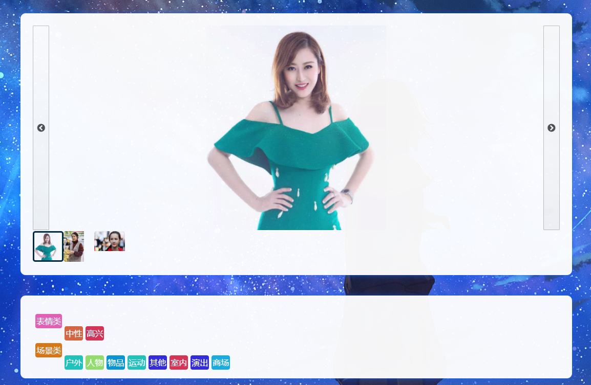

# AI应用平台

[TOC]

## 简介

​		在基于阿里云智能视觉平台的视觉API服务下，我们小组搭建了一个智能AI平台，在这个AI平台中，我们上线了五个不同的的AI视觉应用功能，分别是  身份证识别，智能相册，车辆保险，视频处理，表格识别，我们还为这个平台设计了一个注册登录系统，以保障平台的安全运行。下面我们将介绍每个不同功能。

## 开发环境

- OpenJdk14
- Maven 3.6.3
- Spring Boot 2.3.0
- Aliyun视觉智能API 

## 功能

### 注册登录

#### 简介

​		在注册方式上我们选择了手机号注册，这样的注册更加安全，在密码的设置上，我们使用了双重输入，这样可以防止由于手误导致的无法登录账号的不良后果，我们还设置了一个验证码系统，这样的可以防止机器人批量访问，在注册完成后将会向您发送一个验证码，用以验证账户

#### 功能使用

​		填入自己的手机号，需要设定的密码以及验证码，点击提交

​		等待系统发送验证码，输入验证码，点击提交

### 身份证识别

#### 简介

​		我们常常需要在不同的资料中提交或者录入自己的身份证资料，大量的录入十分的繁琐，所以我们做了一个身份证识别功能，这样可以快速的将自己的自己的身份证信息提取到电脑上，让这项工作变得不再麻烦！

#### 功能使用

​		点击上传人像面，找到人像面照片的位置

​		点击上传国徽面，找到国徽面照片的位置

​		点击开始识别后，就会生成信息

### 智能相册

#### 简介

​		我们常常会用相机来记录自己的心情与生活，但由于大量图片的堆积，我们总是很难在相册里找到自己想要的图片，为此，我们做了一个智能相册系统，在这个系统中我们可以轻易的识别出照片的场景以及人物的心情来对相片进行分类，让我们在记录的过程中不再有后顾之忧

#### 功能使用

​		（TODO： 还在改进）

### 车辆保险

#### 简介

​		日常生活中，办理汽车保险是一件十分麻烦的事情，我们需要花费大量的时间来去向保险公司提供大量的资料，对于不了解的人来说，不同的资料很容易弄得手忙脚乱，而保险公司也许要大量的人员来计算保费，赔付金额以及统筹大量信息，为此，我们设计出了一个车辆保险自助申请系统，本系统可通过提交自己的汽车图片进行汽车保单的自动生成，十分的简单易用，能够大大的减轻人力物力，极大地提高办事效率，让我们的生活变得更加便利！

#### 功能使用

​		在系统的主页中，我们需要使用“上传您的车”按钮，来进行个人车辆图片的上传

​		在上传完图片之后，我们只需要单机“开始计算保单”按钮，就能快速的生成自己的保单

### 视频处理

#### 简介

​		在我们小时候总是会有那么一部让我们喜欢的动画或者影视剧，可当长大后的我们再去回味是却发现，由于时代的发展，我们在接受了画质的不断提高后，就很难接受那些我们想回味的片子的画质了，由俭入奢易，由奢入俭难。在这样的情况下，我们设计了一个视频高清化功能，让模糊的视频变得清晰，当我们将想回味的片子进行高清化之后，我们就可以开心的进行那些美好的回味了！

#### 功能使用

​		点击上传视频，找到要高清化视频的位置

​		点击开始优化后，就会在云端进行高清化

​		点击下载视频，下载高清后

### 表格识别

#### 简介

​		日常工作中，Excel表格虽然使用起来非常强大，但是录入表格确实一件麻烦的事情，很多时候我们都拿不到源文件，尤其是当我们面对着一张Excel表格的图片来说，真的是欲哭无泪。为了解决这一个让人难受的情况，我们做了这一个表格识别功能，终于可以不再对着一张Excel表格的图片难受了！

#### 功能使用

​		点击上传表格图片，进行上传

​		点击开始识别，生成表格

## 最终效果

### 主界面

> 只有登陆后才能访问这些功能

### 注册界面

### 短信验证界面

### 登录界面 

> 连续3次错误将会触发验证码验证，防止暴力破解登录

### 身份证识别

### 智能相册

### 车辆保险

> 自动生成的打印单，再点击“下载图片以打印”后显示

### 视频高清化

> 因为是异步请求，所以可能需要等一段时间才能处理完成

### 表格识别

> 由李晶同学提供

### 视频去水印

## 演示视频

## 致谢

感谢Aliyun AI一期二组的组员对这个项目的帮助~

特别感谢以下组员！（没有排名）

- **玄璃**（apg-i2wci1fw7）
- **fanfanfan**（1as-735v5hprho）
- **李晶**（brrz1vc）